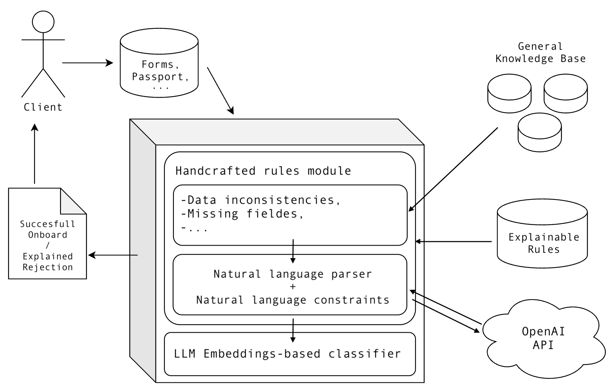

# 🏦 Client Onboarding for Private Banking  
*Julius Bär Challenge - ETHZ ACE Datathon 2025*  
**Team:** Andreas Spanopoulos, Hector Maeso, Marcell Schnieder, Juan Garcia



## 🚀 TL;DR
We built a **modular and explainable onboarding system** that filters private banking clients using a combination of **handcrafted rules**, **language models**, and a **classifier based on LLM embeddings**. The system is efficient, reliable, and offers transparent rejection reasons for clients.

---

## 🧠 System Architecture

Our onboarding pipeline is composed of the following steps:

1. **Data ingestion:** Client `.json` data is loaded into a structured container and passed into the onboarding model.
2. **Basic validation:** Simple constraints are checked using an **explainable rules knowledge base**. If a rule fails, the client is rejected with a log of the violated rule.
3. **Semantic validation:** For complex fields, natural language inputs are parsed via the **OpenAI API**, then validated with the same rules.
4. **Final check:** If all handcrafted checks pass, we extract **LLM-based embeddings** (via **RoBERTa**) and use a small **MLP classifier** to make the final accept/reject decision.

---

## 🔍 Explainability & Risk

- Most client rejections are **fully explainable** and based on deterministic rules.
- **Human oversight** is suggested only for edge cases involving semantic interpretation.
- **Handcrafted rule failures** are annotated and logged clearly, making the model transparent and auditable.
- **False rejection rate:** **<1%**, helping reduce reputational risks.
- Next focus: Improving filtering of **undesired acceptances** to ensure regulatory compliance.

---

## ⚙️ Resource Efficiency

- 🕒 **~1 second** per classification on a GPU laptop  
- 🌍 **< $0.01 CHF** API cost per client  
- 🔧 Rules are executed in order of **increasing resource cost**  
- 🧩 **Modular design** allows for plug-and-play rule updates or model swaps

> 🧾 Total development cost: **< $10 CHF** (OpenAI API usage)

---

## 📊 Results

- **Validation accuracy:** ~95%  
- Most incorrect predictions are **false acceptances**, not false rejections
- Accuracy can be further improved with:
  - Domain expert feedback
  - Human-in-the-loop between modules
  - More advanced LLMs or rule refinement

---

## ✅ Conclusions

Our onboarding system combines:
- ✅ **Transparency** in rejections  
- 🤖 **Powerful language model support**  
- 🧱 **Robust, modular rule-based structure**

It is capable of handling complex, nuanced cases while ensuring most decisions are **auditable, interpretable, and compliant**.

> 📉 False rejection rate: **<1%**  
> ⚠️ Focus area for improvement: **false acceptances** and compliance mitigation

---

## 📁 Project Structure

```bash
.
├── data/                 # Client data (input)
├── images/               # Project visuals
│   └── empty-diagram.png
├── rules/                # Handcrafted explainable rules
├── models/               # Embedding + classification modules
├── api/                  # OpenAI-based language field validation
└── main.py               # Pipeline entrypoint

